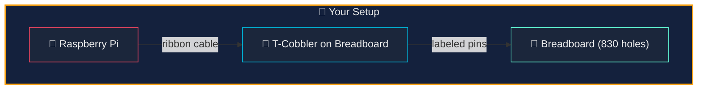
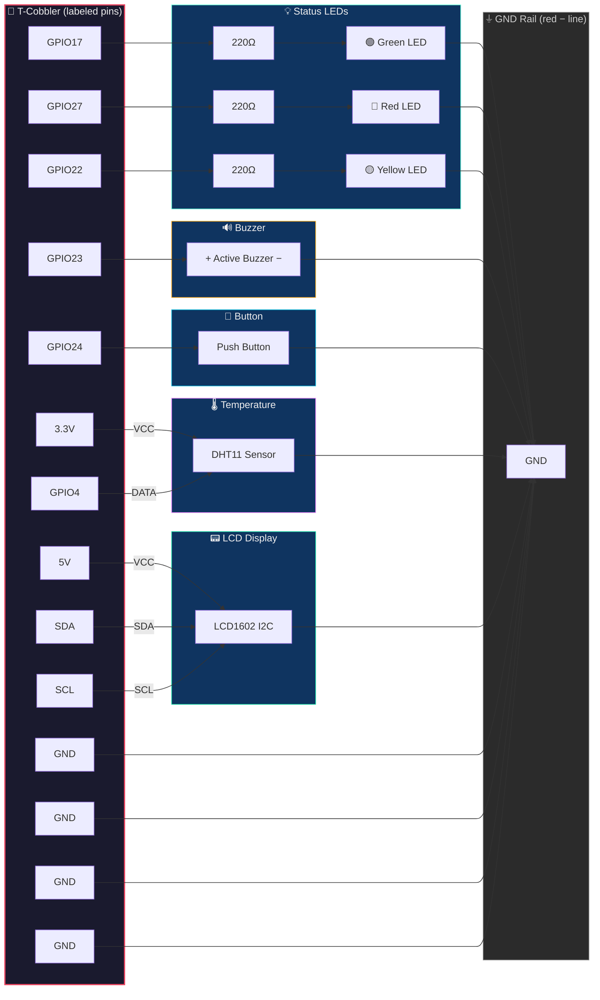
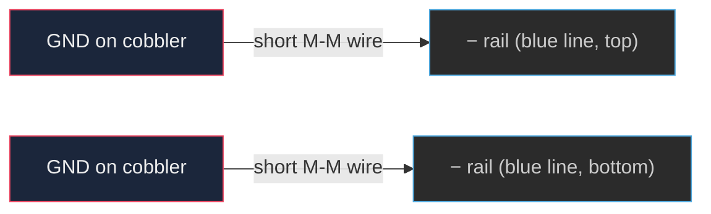
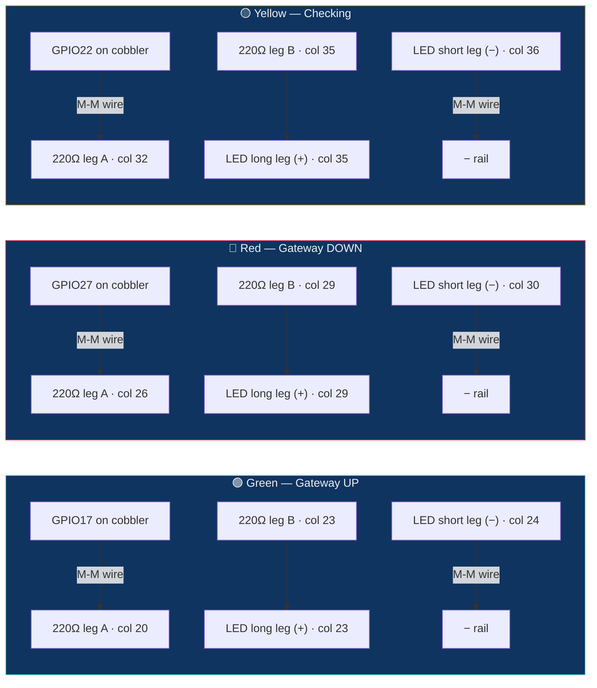
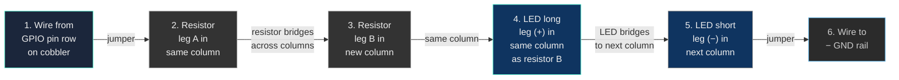
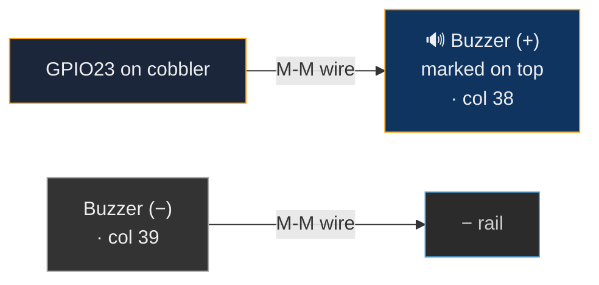
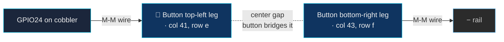
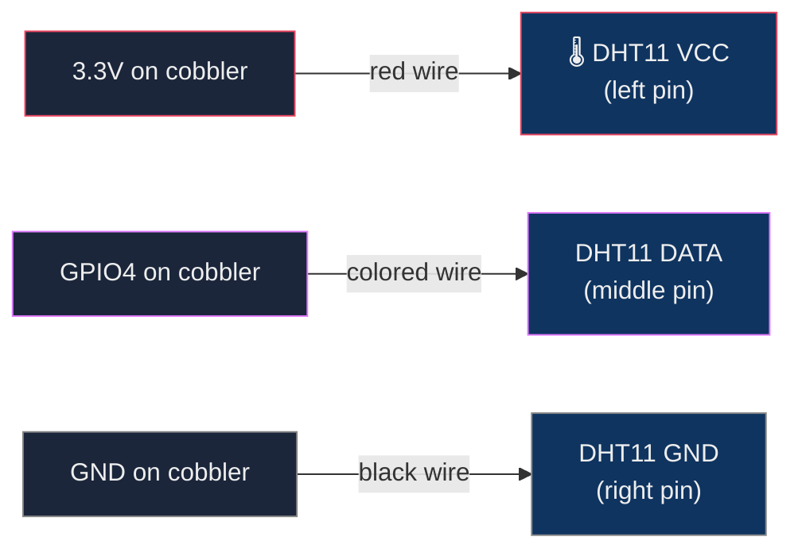
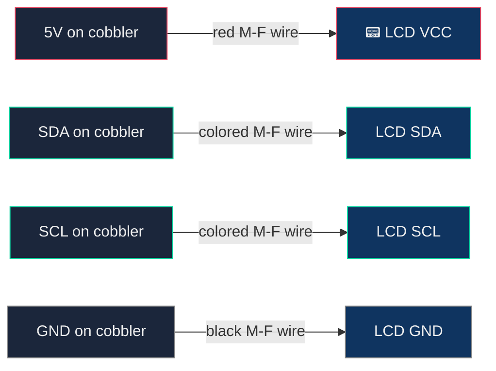
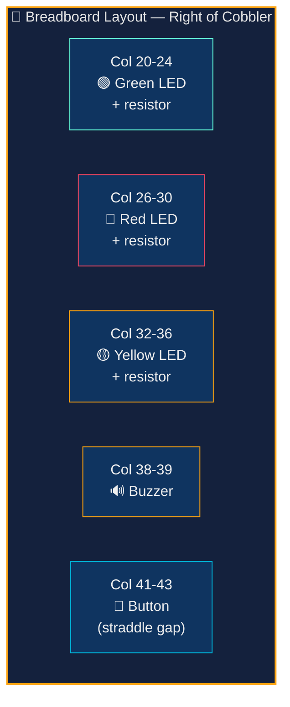

# Wiring Guide — GPIO Physical Dashboard

Components from the Freenove Ultimate Starter Kit (FNK0020).

## Setup

This guide assumes you're using the **GPIO T-cobbler extension board** with a ribbon cable, plugged into the center of the breadboard. All pin references use the **labels printed on the cobbler**.



## Parts needed

| Component | Qty | From kit |
|-----------|-----|----------|
| Green LED | 1 | Yes |
| Red LED | 1 | Yes |
| Yellow LED | 1 | Yes |
| 220 ohm resistor | 3 | Yes |
| Active buzzer | 1 | Yes |
| Push button | 1 | Yes |
| DHT11 temp/humidity sensor | 1 | Yes |
| LCD1602 with I2C backpack | 1 | Yes |
| Jumper wires (M-M) | ~12 | Yes |

## Full wiring diagram



## Step 0 — Ground rail

Before wiring any components, connect the **GND rail** on the breadboard.



Your cobbler has **multiple GND pins**. Wire at least one to each side rail (top `−` and bottom `−`). This gives every component access to ground.

## Step 1 — Status LEDs



**How to wire each LED:**



> **LED tip**: Long leg = positive (+, anode). Short leg = negative (−, cathode). If unsure, the flat edge on the LED base is the cathode side.

## Step 2 — Active Buzzer



> **Buzzer tip**: The `+` is printed on top. Longer leg is also `+`. If no sound later, flip it around.

## Step 3 — Push Button

The button **straddles the center gap** of the breadboard.



> **Button tip**: Push buttons have 4 legs. Place it so it **straddles the center gap**. The legs on the same side are always connected — pressing connects the two sides. No external resistor needed.

## Step 4 — DHT11 Temperature Sensor



> **DHT11 tip**: Face the blue grid toward you. Pins left to right: VCC, DATA, GND (3-pin module) or VCC, DATA, NC, GND (4-pin module). The sensor plugs directly into the breadboard.

## Step 5 — LCD1602 (I2C)

Use **M-to-F jumper wires** (male into breadboard/cobbler, female onto LCD pins).



> **LCD tip**: Connect to the **I2C backpack** (small board soldered to the back), not the 16-pin header. After wiring, verify: `i2cdetect -y 1` — look for `27` or `3f`.

## Pin reference table

| Cobbler label | Component | Wire color suggestion |
|---------------|-----------|----------------------|
| GPIO17 | → 220Ω → Green LED → GND rail | Green wire |
| GPIO27 | → 220Ω → Red LED → GND rail | Red wire |
| GPIO22 | → 220Ω → Yellow LED → GND rail | Yellow wire |
| GPIO23 | → Buzzer (+) | Orange wire |
| GPIO24 | → Button leg | Blue wire |
| GPIO4 | → DHT11 DATA | Purple wire |
| 3.3V | → DHT11 VCC | Red wire |
| 5V | → LCD VCC | Red wire |
| SDA | → LCD SDA | Green wire |
| SCL | → LCD SCL | White wire |
| GND (x4) | → GND rails, Buzzer −, DHT11 GND, LCD GND | Black wires |

## Breadboard column map

Where to place each component on the breadboard (right side of cobbler):



DHT11 and LCD connect via wires directly to the cobbler — they don't need breadboard columns.

## What each component does

| Component | Behavior |
|-----------|----------|
| 🟢 Green LED | Solid = gateway is UP |
| 🔴 Red LED | Solid = gateway is DOWN |
| 🟡 Yellow LED | Brief flash = health check in progress |
| 🔊 Buzzer | 3 short pulses when gateway goes down |
| 🔘 Button | Press = send Telegram briefing immediately |
| 🌡️ DHT11 | Room temp/humidity shown on LCD and in briefings |
| 📟 LCD1602 | Line 1: gateway status · Line 2: temp + uptime |

## Verify after wiring

```bash
# Check LCD is detected on I2C bus
i2cdetect -y 1

# Restart the scout to pick up hardware
sudo systemctl restart clawpi-scout

# Watch the logs
journalctl -u clawpi-scout -f
```

Expected output:
```
GPIO initialized — LEDs, buzzer, button ready
LCD1602 initialized at 0x27
DHT11 initialized on GPIO4
button watcher started on GPIO24
```
