# Wiring Guide — GPIO Physical Dashboard

Components from the Freenove Ultimate Starter Kit (FNK0020).

## Setup

This guide assumes you're using the **GPIO T-cobbler extension board** with a ribbon cable, plugged into the center of the breadboard. All pin references use the **labels printed on the cobbler**.

```mermaid
graph TD
    subgraph SETUP["🔧 Your Setup"]
        PI["🍓 Raspberry Pi"] -->|"ribbon cable"| COB["📌 T-Cobbler on Breadboard"]
        COB -->|"labeled pins"| BB["📐 Breadboard (830 holes)"]
    end

    style SETUP fill:#14213d,stroke:#fca311,color:#e5e5e5,stroke-width:2px
    style PI fill:#1b263b,stroke:#e94560,color:#eee
    style COB fill:#1b263b,stroke:#00b4d8,color:#eee
    style BB fill:#1b263b,stroke:#64ffda,color:#eee
```



## Parts needed

| Component | Qty | From kit |
|-----------|-----|----------|
| Green LED | 1 | Yes |
| Red LED | 1 | Yes |
| Yellow LED | 1 | Yes |
| 220 ohm resistor | 3 | Yes |
| Active buzzer | 1 | Yes |
| Push button | 1 | Yes |
| DHT11 temp/humidity sensor | 1 | Yes |
| LCD1602 with I2C backpack | 1 | Yes |
| Jumper wires (M-M) | ~12 | Yes |

## Complete wiring — master schematic

Every connection in one diagram. **Solid lines** = signal/power wires. **Dotted lines** = ground wires.

```mermaid
graph LR
    subgraph COB["📌 T-COBBLER — match these labels on your board"]
        direction TB
        GP17["GPIO17"]
        GP27["GPIO27"]
        GP22["GPIO22"]
        GP23["GPIO23"]
        GP24["GPIO24"]
        GP4["GPIO4"]
        V33["3.3V"]
        V5["5V"]
        SDA_P["SDA"]
        SCL_P["SCL"]
        G1["GND ①"]
        G2["GND ②"]
        G3["GND ③"]
        G4["GND ④"]
    end

    subgraph BOARD["📐 ON THE BREADBOARD (right of cobbler)"]
        subgraph S_LED["💡 STATUS LEDs (3x identical circuits)"]
            subgraph SL1["col 20–24"]
                RES1["220Ω"] --- GLED["🟢 Green LED"]
            end
            subgraph SL2["col 26–30"]
                RES2["220Ω"] --- RLED["🔴 Red LED"]
            end
            subgraph SL3["col 32–36"]
                RES3["220Ω"] --- YLED["🟡 Yellow LED"]
            end
        end
        subgraph S_BUZ["🔊 BUZZER · col 38–39"]
            BUZ["Active Buzzer\n(+) marked on top"]
        end
        subgraph S_BTN["🔘 BUTTON · col 41–43"]
            BTN["Push Button\nstraddles center gap"]
        end
    end

    subgraph WIRE["🔌 WIRED DIRECTLY TO COBBLER (off-board)"]
        subgraph S_DHT["🌡️ DHT11 SENSOR"]
            direction TB
            DHT_V["VCC pin"]
            DHT_D["DATA pin"]
            DHT_G["GND pin"]
        end
        subgraph S_LCD["📟 LCD1602 I2C BACKPACK"]
            direction TB
            LCD_V["VCC pin"]
            LCD_S["SDA pin"]
            LCD_C["SCL pin"]
            LCD_G["GND pin"]
        end
    end

    subgraph GND["⏚ BREADBOARD GND RAILS (blue − lines)"]
        direction LR
        TOP_RAIL["top − rail"]
        BOT_RAIL["bottom − rail"]
    end

    %% Signal wires: cobbler → breadboard components
    GP17 -- "green wire" --> RES1
    GP27 -- "red wire" --> RES2
    GP22 -- "yellow wire" --> RES3
    GP23 -- "orange wire" --> BUZ
    GP24 -- "blue wire" --> BTN

    %% Ground return: components → GND rails
    GLED -. "LED (−) → GND" .-> TOP_RAIL
    RLED -. "LED (−) → GND" .-> TOP_RAIL
    YLED -. "LED (−) → GND" .-> TOP_RAIL
    BUZ -. "buzzer (−) → GND" .-> TOP_RAIL
    BTN -. "leg → GND" .-> BOT_RAIL

    %% DHT11: 3 wires direct to cobbler
    V33 -- "red wire · VCC" --> DHT_V
    GP4 -- "purple wire · DATA" --> DHT_D
    G3 -. "black wire · GND" .-> DHT_G

    %% LCD: 4 wires direct to cobbler (M-to-F)
    V5 -- "red wire · VCC" --> LCD_V
    SDA_P -- "green wire · SDA" --> LCD_S
    SCL_P -- "white wire · SCL" --> LCD_C
    G4 -. "black wire · GND" .-> LCD_G

    %% Cobbler GND pins → rails
    G1 -. "black wire" .-> TOP_RAIL
    G2 -. "black wire" .-> BOT_RAIL

    %% Styles
    style COB fill:#1a1a2e,stroke:#e94560,color:#eee,stroke-width:3px
    style BOARD fill:#0a1628,stroke:#64ffda,color:#eee,stroke-width:2px
    style WIRE fill:#0a1628,stroke:#e07aff,color:#eee,stroke-width:2px
    style GND fill:#1a1a1a,stroke:#666,color:#ccc,stroke-width:2px
    style S_LED fill:#0f3460,stroke:#64ffda,color:#eee
    style S_BUZ fill:#0f3460,stroke:#fca311,color:#eee
    style S_BTN fill:#0f3460,stroke:#00b4d8,color:#eee
    style S_DHT fill:#0f3460,stroke:#e07aff,color:#eee
    style S_LCD fill:#0f3460,stroke:#06d6a0,color:#eee
    style SL1 fill:#162447,stroke:#64ffda,color:#eee
    style SL2 fill:#162447,stroke:#e94560,color:#eee
    style SL3 fill:#162447,stroke:#fca311,color:#eee
```



## Physical breadboard layout

Bird's-eye view — looking down at your breadboard with the cobbler plugged in.

```
    (−) GND rail ══════════════════════════════════════════════════
    ┌──────────────────────────────────────────────────────────────┐
    │                                                              │
    │              ┌─────────┐  ┌──────┐ ┌──────┐ ┌──────┐       │
    │              │         │  │ 220Ω │ │ 220Ω │ │ 220Ω │ ┌──┐  │
    │  rows        │         │  │  🟢  │ │  🔴  │ │  🟡  │ │🔊│  │
    │  a – e       │  T-COB  │  │  │   │ │  │   │ │  │   │ │ ││  │
    │  (top half)  │  BLER   │  │  ↓   │ │  ↓   │ │  ↓   │ │ ↓│  │ ┌───┐
    │              │         │  │→GND  │ │→GND  │ │→GND  │ │GND│  │ │🔘 │
    │              │ GPIO17 ─╫──┘      │ │      │ │      │ └──┘  │ │   │
    │              │ GPIO27 ─╫─────────┘ │      │ │      │ c38-39│ │   │
    │              │ GPIO22 ─╫───────────┘      │ │      │       │ │   │
    │              │ GPIO23 ─╫──────────────────┘ │      │       │ │   │
    │              │ GPIO24 ─╫────────────────────┘──────┘───────┘─┘   │
    │  ════════════╡═════════╡══════════════ center gap ════════│···│══│
    │              │         │                                  │   │  │
    │  rows        │ GND  ───╫──→ top (−) rail                 │🔘 │  │
    │  f – j       │ GND  ───╫──→ bottom (−) rail              │ ↓ │  │
    │  (bot half)  │         │                                  │→GND│  │
    │              │         │                                  └───┘  │
    │              └─────────┘                              col 41-43  │
    │               col 1-15       col 20-24  26-30  32-36             │
    │                                                                  │
    └──────────────────────────────────────────────────────────────────┘
    (−) GND rail ══════════════════════════════════════════════════

    OFF-BOARD — wired directly to cobbler pins (not on breadboard):

    ┌────────────────┐       ┌───────────────────┐
    │  🌡️ DHT11      │       │  📟 LCD1602 I2C    │
    │                │       │                   │
    │  VCC  ← 3.3V  │       │  VCC ← 5V         │
    │  DATA ← GPIO4  │       │  SDA ← SDA        │
    │  GND  ← GND    │       │  SCL ← SCL        │
    └────────────────┘       │  GND ← GND        │
                              └───────────────────┘
```

> **Reading the layout**: The T-cobbler sits in the center of the breadboard (cols ~1–15). All breadboard components go to the **right** of the cobbler. The button straddles the center gap (rows e/f). DHT11 and LCD plug into the cobbler with direct wires — they don't sit on the breadboard.

## Step 0 — Ground rail

Before wiring any components, connect the **GND rail** on the breadboard.

```mermaid
graph LR
    GND_COB["GND on cobbler"] -->|"short M-M wire"| RAIL_TOP["− rail (blue line, top)"]
    GND_COB2["GND on cobbler"] -->|"short M-M wire"| RAIL_BOT["− rail (blue line, bottom)"]

    style GND_COB fill:#1b263b,stroke:#e94560,color:#eee
    style GND_COB2 fill:#1b263b,stroke:#e94560,color:#eee
    style RAIL_TOP fill:#2b2b2b,stroke:#4ea8de,color:#ccc
    style RAIL_BOT fill:#2b2b2b,stroke:#4ea8de,color:#ccc
```



Your cobbler has **multiple GND pins**. Wire at least one to each side rail (top `−` and bottom `−`). This gives every component access to ground.

## Step 1 — Status LEDs

```mermaid
graph LR
    subgraph GREEN["🟢 Green — Gateway UP"]
        GP17["GPIO17 on cobbler"] -->|"M-M wire"| R1A["220Ω leg A · col 20"]
        R1B["220Ω leg B · col 23"] --> GL_PLUS["LED long leg (+) · col 23"]
        GL_MINUS["LED short leg (−) · col 24"] -->|"M-M wire"| GND1["− rail"]
    end

    subgraph RED["🔴 Red — Gateway DOWN"]
        GP27["GPIO27 on cobbler"] -->|"M-M wire"| R2A["220Ω leg A · col 26"]
        R2B["220Ω leg B · col 29"] --> RL_PLUS["LED long leg (+) · col 29"]
        RL_MINUS["LED short leg (−) · col 30"] -->|"M-M wire"| GND2["− rail"]
    end

    subgraph YELLOW["🟡 Yellow — Checking"]
        GP22["GPIO22 on cobbler"] -->|"M-M wire"| R3A["220Ω leg A · col 32"]
        R3B["220Ω leg B · col 35"] --> YL_PLUS["LED long leg (+) · col 35"]
        YL_MINUS["LED short leg (−) · col 36"] -->|"M-M wire"| GND3["− rail"]
    end

    style GREEN fill:#0f3460,stroke:#64ffda,color:#eee
    style RED fill:#0f3460,stroke:#e94560,color:#eee
    style YELLOW fill:#0f3460,stroke:#fca311,color:#eee
```



**How to wire each LED:**

```mermaid
graph LR
    A["1. Wire from\nGPIO pin row\non cobbler"] -->|"jumper"| B["2. Resistor\nleg A in\nsame column"]
    B -->|"resistor bridges\nacross columns"| C["3. Resistor\nleg B in\nnew column"]
    C -->|"same column"| D["4. LED long\nleg (+) in\nsame column\nas resistor B"]
    D -->|"LED bridges\nto next column"| E["5. LED short\nleg (−) in\nnext column"]
    E -->|"jumper"| F["6. Wire to\n− GND rail"]

    style A fill:#1b263b,stroke:#64ffda,color:#eee
    style B fill:#333,stroke:#aaa,color:#eee
    style C fill:#333,stroke:#aaa,color:#eee
    style D fill:#0f3460,stroke:#64ffda,color:#eee
    style E fill:#0f3460,stroke:#888,color:#eee
    style F fill:#2b2b2b,stroke:#4ea8de,color:#ccc
```



> **LED tip**: Long leg = positive (+, anode). Short leg = negative (−, cathode). If unsure, the flat edge on the LED base is the cathode side.

## Step 2 — Active Buzzer

```mermaid
graph LR
    GP23["GPIO23 on cobbler"] -->|"M-M wire"| BZ_PLUS["🔊 Buzzer (+)\nmarked on top\n· col 38"]
    BZ_MINUS["Buzzer (−)\n· col 39"] -->|"M-M wire"| GND["− rail"]

    style GP23 fill:#1b263b,stroke:#fca311,color:#eee
    style BZ_PLUS fill:#0f3460,stroke:#fca311,color:#eee
    style BZ_MINUS fill:#333,stroke:#aaa,color:#eee
    style GND fill:#2b2b2b,stroke:#4ea8de,color:#ccc
```



> **Buzzer tip**: The `+` is printed on top. Longer leg is also `+`. If no sound later, flip it around.

## Step 3 — Push Button

The button **straddles the center gap** of the breadboard.


> **Button tip**: Push buttons have 4 legs. Place it so it **straddles the center gap**. The legs on the same side are always connected — pressing connects the two sides. No external resistor needed.

## Step 4 — DHT11 Temperature Sensor

```mermaid
graph LR
    V33["3.3V on cobbler"] -->|"red wire"| VCC["🌡️ DHT11 VCC\n(left pin)"]
    GP4["GPIO4 on cobbler"] -->|"colored wire"| DATA["DHT11 DATA\n(middle pin)"]
    GND_COB["GND on cobbler"] -->|"black wire"| DGND["DHT11 GND\n(right pin)"]

    style V33 fill:#1b263b,stroke:#e94560,color:#eee
    style GP4 fill:#1b263b,stroke:#e07aff,color:#eee
    style GND_COB fill:#1b263b,stroke:#888,color:#eee
    style VCC fill:#0f3460,stroke:#e94560,color:#eee
    style DATA fill:#0f3460,stroke:#e07aff,color:#eee
    style DGND fill:#0f3460,stroke:#888,color:#eee
```



> **DHT11 tip**: Face the blue grid toward you. Pins left to right: VCC, DATA, GND (3-pin module) or VCC, DATA, NC, GND (4-pin module). The sensor plugs directly into the breadboard.

## Step 5 — LCD1602 (I2C)

Use **M-to-F jumper wires** (male into breadboard/cobbler, female onto LCD pins).

```mermaid
graph LR
    V5["5V on cobbler"] -->|"red M-F wire"| LVCC["📟 LCD VCC"]
    SDA["SDA on cobbler"] -->|"colored M-F wire"| LSDA["LCD SDA"]
    SCL["SCL on cobbler"] -->|"colored M-F wire"| LSCL["LCD SCL"]
    GND_COB["GND on cobbler"] -->|"black M-F wire"| LGND["LCD GND"]

    style V5 fill:#1b263b,stroke:#e94560,color:#eee
    style SDA fill:#1b263b,stroke:#06d6a0,color:#eee
    style SCL fill:#1b263b,stroke:#06d6a0,color:#eee
    style GND_COB fill:#1b263b,stroke:#888,color:#eee
    style LVCC fill:#0f3460,stroke:#e94560,color:#eee
    style LSDA fill:#0f3460,stroke:#06d6a0,color:#eee
    style LSCL fill:#0f3460,stroke:#06d6a0,color:#eee
    style LGND fill:#0f3460,stroke:#888,color:#eee
```



> **LCD tip**: Connect to the **I2C backpack** (small board soldered to the back), not the 16-pin header. After wiring, verify: `i2cdetect -y 1` — look for `27` or `3f`.

## Pin reference table

| Cobbler label | Component | Wire color suggestion |
|---------------|-----------|----------------------|
| GPIO17 | → 220Ω → Green LED → GND rail | Green wire |
| GPIO27 | → 220Ω → Red LED → GND rail | Red wire |
| GPIO22 | → 220Ω → Yellow LED → GND rail | Yellow wire |
| GPIO23 | → Buzzer (+) | Orange wire |
| GPIO24 | → Button leg | Blue wire |
| GPIO4 | → DHT11 DATA | Purple wire |
| 3.3V | → DHT11 VCC | Red wire |
| 5V | → LCD VCC | Red wire |
| SDA | → LCD SDA | Green wire |
| SCL | → LCD SCL | White wire |
| GND (x4) | → GND rails, Buzzer −, DHT11 GND, LCD GND | Black wires |

## Wire tracing — every connection at a glance

Use this to double-check your work. Trace each wire from cobbler pin to destination.

```mermaid
graph LR
    subgraph TRACE["🔍 Trace each wire"]
        direction TB
        W1["🟢 green wire:   GPIO17 → 220Ω → Green LED(+) → LED(−) → GND rail"]
        W2["🔴 red wire:     GPIO27 → 220Ω → Red LED(+) → LED(−) → GND rail"]
        W3["🟡 yellow wire:  GPIO22 → 220Ω → Yellow LED(+) → LED(−) → GND rail"]
        W4["🟠 orange wire:  GPIO23 → Buzzer(+) → Buzzer(−) → GND rail"]
        W5["🔵 blue wire:    GPIO24 → Button leg(e) → Button leg(f) → GND rail"]
        W6["🟣 purple wire:  GPIO4 → DHT11 DATA"]
        W7["🔴 red wire:     3.3V → DHT11 VCC"]
        W8["🔴 red wire:     5V → LCD VCC"]
        W9["🟢 green wire:   SDA → LCD SDA"]
        W10["⚪ white wire:   SCL → LCD SCL"]
        W11["⚫ black wires:  GND×2 → rails · GND → DHT11 · GND → LCD"]
    end

    style TRACE fill:#14213d,stroke:#fca311,color:#e5e5e5,stroke-width:2px
```



## What each component does

| Component | Behavior |
|-----------|----------|
| 🟢 Green LED | Solid = gateway is UP |
| 🔴 Red LED | Solid = gateway is DOWN |
| 🟡 Yellow LED | Brief flash = health check in progress |
| 🔊 Buzzer | 3 short pulses when gateway goes down |
| 🔘 Button | Press = send Telegram briefing immediately |
| 🌡️ DHT11 | Room temp/humidity shown on LCD and in briefings |
| 📟 LCD1602 | Line 1: gateway status · Line 2: temp + uptime |

## Verify after wiring

```bash
# Check LCD is detected on I2C bus
i2cdetect -y 1

# Restart the scout to pick up hardware
sudo systemctl restart clawpi-scout

# Watch the logs
journalctl -u clawpi-scout -f
```

Expected output:
```
GPIO initialized — LEDs, buzzer, button ready
LCD1602 initialized at 0x27
DHT11 initialized on GPIO4
button watcher started on GPIO24
```
