# Wiring Guide — GPIO Physical Dashboard

Components from the Freenove Ultimate Starter Kit (FNK0020) or equivalent.

## Parts needed

| Component | Qty | From kit |
|-----------|-----|----------|
| Green LED | 1 | Yes |
| Red LED | 1 | Yes |
| Yellow LED | 1 | Yes |
| 220 ohm resistor | 3 | Yes |
| Active buzzer | 1 | Yes |
| Push button | 1 | Yes |
| DHT11 temp/humidity sensor | 1 | Yes |
| LCD1602 with I2C backpack | 1 | Yes |
| Breadboard | 1 | Yes |
| Jumper wires (M-F, M-M) | ~15 | Yes |

## Full wiring diagram

```mermaid
graph LR
    subgraph PI["🍓 Raspberry Pi GPIO"]
        P2["Pin 2 · 5V"]
        P3["Pin 3 · SDA"]
        P5["Pin 5 · SCL"]
        P6["Pin 6 · GND"]
        P7["Pin 7 · GP4"]
        P9["Pin 9 · GND"]
        P11["Pin 11 · GP17"]
        P13["Pin 13 · GP27"]
        P14["Pin 14 · GND"]
        P15["Pin 15 · GP22"]
        P16["Pin 16 · GP23"]
        P17["Pin 17 · 3V3"]
        P18["Pin 18 · GP24"]
        P20["Pin 20 · GND"]
    end

    subgraph LEDS["💡 Status LEDs"]
        R1["220Ω"] --> G["🟢 Green LED"]
        R2["220Ω"] --> R["🔴 Red LED"]
        R3["220Ω"] --> Y["🟡 Yellow LED"]
    end

    subgraph AUDIO["🔊 Buzzer"]
        BZ["+  Active Buzzer  −"]
    end

    subgraph INPUT["🔘 Button"]
        BTN["Push Button"]
    end

    subgraph SENSOR["🌡️ Temperature"]
        DHT["DHT11 Sensor"]
    end

    subgraph DISPLAY["📟 LCD Display"]
        LCD["LCD1602 I2C"]
    end

    subgraph GND_RAIL["⏚ Ground Rail"]
        GROUND["GND (shared)"]
    end

    P11 --> R1
    P13 --> R2
    P15 --> R3
    G --> GROUND
    R --> GROUND
    Y --> GROUND

    P16 --> BZ
    BZ --> GROUND

    P18 --> BTN
    BTN --> GROUND

    P17 -->|"3V3"| DHT
    P7 -->|"DATA"| DHT
    DHT --> GROUND

    P2 -->|"5V"| LCD
    P3 -->|"SDA"| LCD
    P5 -->|"SCL"| LCD
    LCD --> GROUND

    P6 --> GROUND
    P9 --> GROUND
    P14 --> GROUND
    P20 --> GROUND

    style PI fill:#1a1a2e,stroke:#e94560,color:#eee,stroke-width:2px
    style LEDS fill:#0f3460,stroke:#64ffda,color:#eee
    style AUDIO fill:#0f3460,stroke:#fca311,color:#eee
    style INPUT fill:#0f3460,stroke:#00b4d8,color:#eee
    style SENSOR fill:#0f3460,stroke:#e07aff,color:#eee
    style DISPLAY fill:#0f3460,stroke:#06d6a0,color:#eee
    style GND_RAIL fill:#2b2b2b,stroke:#888,color:#ccc
```



## Wiring by component

### Step 1 — Status LEDs

```mermaid
graph LR
    GP17["GP17 · Pin 11"] -->|wire| R1["220Ω resistor"]
    R1 --> GL["🟢 LED + (long leg)"]
    GL -->|"short leg"| GND1["⏚ GND"]

    GP27["GP27 · Pin 13"] -->|wire| R2["220Ω resistor"]
    R2 --> RL["🔴 LED + (long leg)"]
    RL -->|"short leg"| GND2["⏚ GND"]

    GP22["GP22 · Pin 15"] -->|wire| R3["220Ω resistor"]
    R3 --> YL["🟡 LED + (long leg)"]
    YL -->|"short leg"| GND3["⏚ GND"]

    style GP17 fill:#1b263b,stroke:#64ffda,color:#eee
    style GP27 fill:#1b263b,stroke:#e94560,color:#eee
    style GP22 fill:#1b263b,stroke:#fca311,color:#eee
```



> **LED tip**: Long leg = positive (+, anode). Short leg = negative (−, cathode, goes to GND).

### Step 2 — Active Buzzer


> **Buzzer tip**: Look for the `+` symbol printed on top. If no sound later, flip it.

### Step 3 — Push Button


> **Button tip**: Straddle the center gap of the breadboard. No external resistor needed — the code uses the Pi's internal pull-up.

### Step 4 — DHT11 Temperature Sensor

```mermaid
graph LR
    V33["3V3 · Pin 17"] -->|"red wire"| VCC["DHT11 VCC"]
    GP4["GP4 · Pin 7"] -->|"data wire"| DATA["🌡️ DHT11 DATA"]
    GND["⏚ GND · Pin 9"] -->|"black wire"| DGND["DHT11 GND"]

    VCC --- DATA --- DGND

    style GP4 fill:#1b263b,stroke:#e07aff,color:#eee
    style V33 fill:#1b263b,stroke:#e94560,color:#eee
```



> **DHT11 tip**: If your module has 4 pins, use pins 1 (VCC), 2 (DATA), 4 (GND). Pin 3 is unused.

### Step 5 — LCD1602 (I2C)

```mermaid
graph LR
    V5["5V · Pin 2"] -->|"red wire"| LVCC["📟 LCD VCC"]
    SDA["SDA · Pin 3"] -->|"data wire"| LSDA["LCD SDA"]
    SCL["SCL · Pin 5"] -->|"clock wire"| LSCL["LCD SCL"]
    GND["⏚ GND · Pin 6"] -->|"black wire"| LGND["LCD GND"]

    LVCC --- LSDA --- LSCL --- LGND

    style V5 fill:#1b263b,stroke:#e94560,color:#eee
    style SDA fill:#1b263b,stroke:#06d6a0,color:#eee
    style SCL fill:#1b263b,stroke:#06d6a0,color:#eee
```



> **LCD tip**: The I2C backpack is the small board soldered to the back with 4 pins (GND, VCC, SDA, SCL). Connect to those, not the 16-pin header. After wiring, verify with `i2cdetect -y 1` — look for `27` or `3f`.

## Pin assignments (BCM numbering)

| Component | GPIO | Physical pin | Direction |
|-----------|------|-------------|-----------|
| Green LED | 17 | 11 | Output |
| Red LED | 27 | 13 | Output |
| Yellow LED | 22 | 15 | Output |
| Active buzzer | 23 | 16 | Output |
| Push button | 24 | 18 | Input (pull-up) |
| DHT11 data | 4 | 7 | Input |
| LCD1602 SDA | 2 | 3 | I2C |
| LCD1602 SCL | 3 | 5 | I2C |

## Quick reference — all connections

```mermaid
graph TD
    subgraph PIN_MAP["📌 Raspberry Pi Pin Map"]
        direction LR
        LEFT["Pin 1 · 3V3
Pin 3 · SDA → LCD
Pin 5 · SCL → LCD
Pin 7 · GP4 → DHT11
Pin 9 · GND → DHT11
Pin 11 · GP17 → Green LED
Pin 13 · GP27 → Red LED
Pin 15 · GP22 → Yellow LED
Pin 17 · 3V3 → DHT11 VCC"]
        RIGHT["Pin 2 · 5V → LCD
Pin 6 · GND → LCD
Pin 14 · GND → Buzzer
Pin 16 · GP23 → Buzzer
Pin 18 · GP24 → Button
Pin 20 · GND → Button"]
    end

    style PIN_MAP fill:#14213d,stroke:#fca311,color:#e5e5e5,stroke-width:2px
```



## What each component does

| Component | Behavior |
|-----------|----------|
| 🟢 Green LED | Solid = gateway is UP |
| 🔴 Red LED | Solid = gateway is DOWN |
| 🟡 Yellow LED | Brief flash = health check in progress |
| 🔊 Buzzer | 3 short pulses when gateway goes down |
| 🔘 Button | Press = send Telegram briefing immediately |
| 🌡️ DHT11 | Room temp/humidity shown on LCD and in briefings |
| 📟 LCD1602 | Line 1: gateway status · Line 2: temp + uptime |

## Verify after wiring

```bash
# Check LCD is detected on I2C bus
i2cdetect -y 1

# Restart the scout to pick up hardware
sudo systemctl restart clawpi-scout

# Watch the logs
journalctl -u clawpi-scout -f
```

You should see:
```
GPIO initialized — LEDs, buzzer, button ready
LCD1602 initialized at 0x27
DHT11 initialized on GPIO4
button watcher started on GPIO24
```
